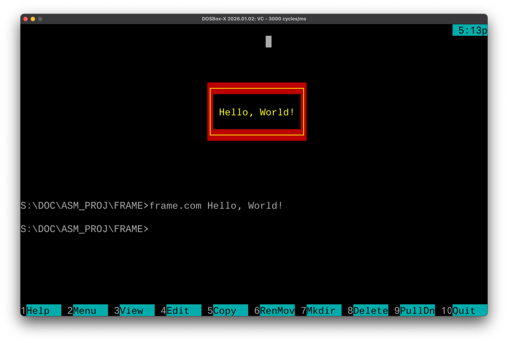
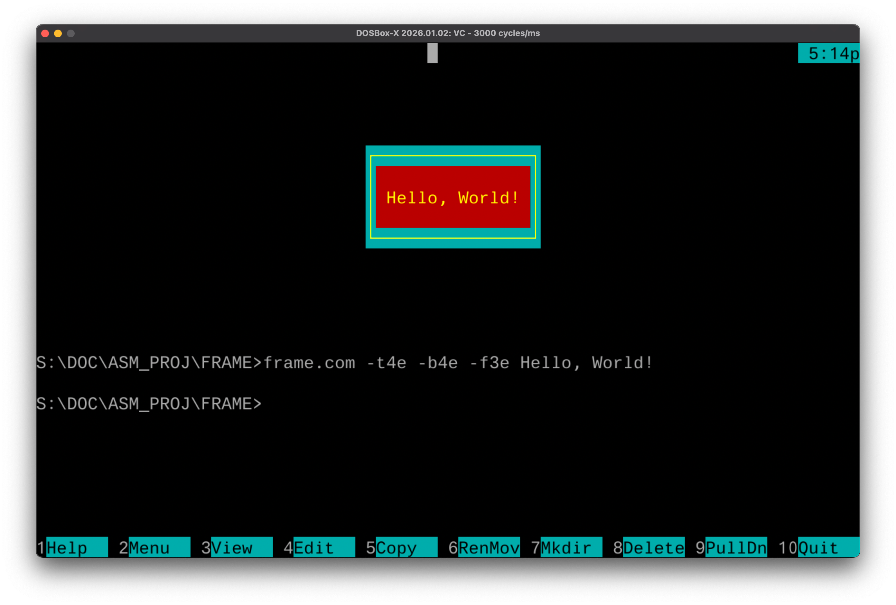
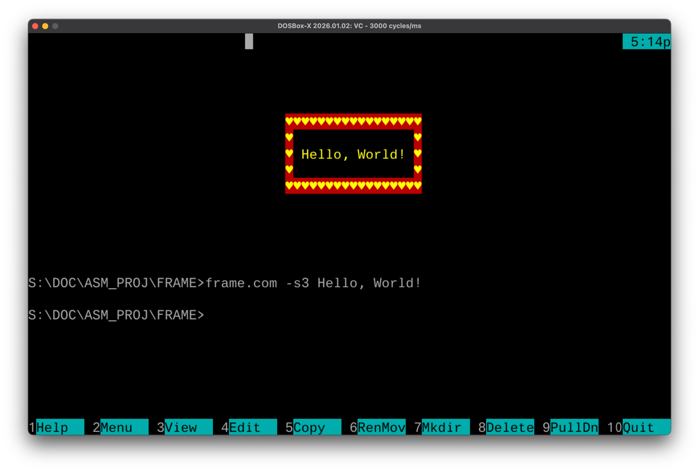
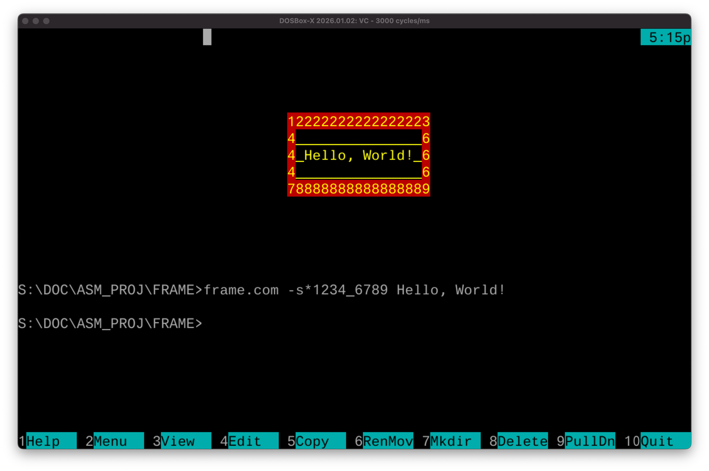

# frame

An educational DOS assembly project (TASM). The program draws a rectangular bordered frame with text directly into video memory — no libraries, just raw writes to segment `B800h`.

> **What's the point?** This project demonstrates how DOS text-mode video works: every character on screen is two bytes in memory (character code + color attribute). The program writes there directly, bypassing all system calls.

## Quick Start

### Build

```
tasm /la /Ipath/to/folder/libs/ frame.asm
tlink /t frame.obj
```

This produces `frame.com`, which runs in DOS or DOSBox.

> you should replace path/to/folder/ with the correct path to the repository (In my case: /IS:\DOC\DOS_ASM\LIBS\).

### Run

```
frame.com [flags] text
```

Examples:

```
frame.com Hello!
frame.com -f1F -b07 -s1 Hello World
```

## Command-Line Flags

All flags are optional and must come **before** the text.

| Flag | Controls | Default |
|------|----------|---------|
| `-b<color>` | Fill color inside the frame | `0E` — yellow on black |
| `-f<color>` | Frame border color | `4E` — yellow on red |
| `-t<color>` | Text color inside the frame | `0E` — yellow on black |
| `-s<style>` | Border style (see below) | `2` — double-line |

**How to specify a color (`<color>`)?**
It's a two-digit hex value: the high nibble is the background color, the low nibble is the foreground (text) color. For example, `1F` = white text on blue background, `4E` = yellow on red. Search for "CGA color attributes" for a full color table.

## Border Styles (`-s`)

| Value | Description | Characters |
|-------|-------------|------------|
| `0` | No border | (space fill only) |
| `1` | Single-line | `┌─┐│ │└─┘` |
| `2` | Double-line (default) | `╔═╗║ ║╚═╝` |
| `3` | Hearts | `♥♥♥♥ ♥♥♥♥` |
| `*` | Custom | Follow `*` with exactly 9 characters: top-left, top, top-right, left, fill, right, bottom-left, bottom, bottom-right |

Custom style example: `-s*+-+| |+-+` draws a frame made of `+` and `-`.

## Examples

<p>
<details>
  <summary>Show screenshots</summary>

  Without additional parameters
  

  Custom colors
  

  Different border style
  

  Custom style
  
</details>
</p>

## How It Works

1. Reads arguments from the PSP command-line buffer at `DS:80h`.
2. Parses the `-b`, `-f`, `-t`, `-s` flags.
3. Measures the text length — this determines the frame width.
4. Sets `ES = B800h` (the DOS text-mode video memory address).
5. Draws the frame and fill by writing character + color attribute pairs directly into video memory.
6. Prints the text centered inside the frame.

The frame is automatically **horizontally centered** on the 80-column screen.

## Code Structure

| Routine | Description |
|---------|-------------|
| `video_mem_offset` (macro) | Converts (col, row) coordinates to a video memory offset: `y×160 + x×2` |
| `PrintCharAt` | Writes a single character with an attribute at a given position |
| `PrintHLine` | Draws a horizontal line of N characters (using `rep stosw`) |
| `PrintVLine` | Draws a vertical line downward (stride = 160 bytes/row) |
| `PrintIVLine` | Draws a vertical line upward |
| `PrintFrame` | Draws a complete frame: corners, edges, and fill |
| `FillFrame` | Fills a rectangle with a given character and attribute |
| `PrintLine` | Writes a string to video memory, stopping at the first control character |

## Default Data

```
╔═══════╗
║ text  ║
╚═══════╝
```

Frame characters are stored in the `frameChars` array (CP437 encoding) and can be replaced via the `-s` flag.